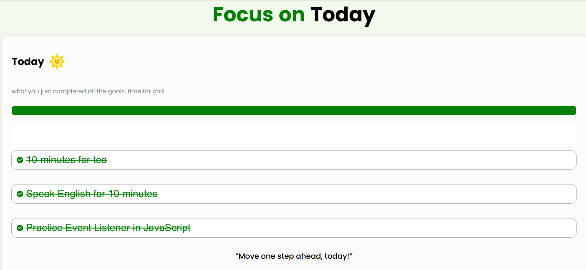
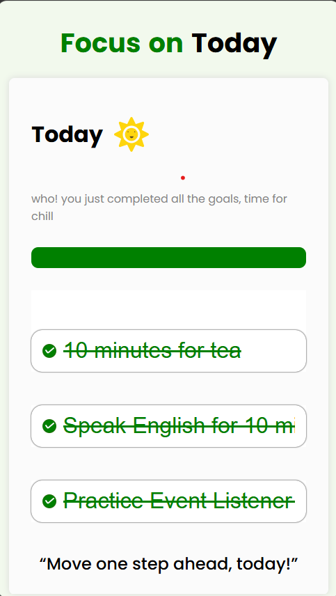

# 🎯 Focus on Today

A simple and responsive Goal Tracker built with **HTML, CSS, and JavaScript**.  
Users can add daily goals, mark them as completed, and their progress is automatically saved using **Local Storage**.

---

## 🚀 Features

- ✅ Add up to 3 daily goals
- ✅ Mark goals as completed
- ✅ Progress bar updates dynamically
- ✅ Motivational quotes based on completed goals
- ✅ Data persists after page refresh using Local Storage
- ✅ Completed goals become read-only
- ✅ Fully responsive design for mobile, tablet, and desktop

---

## 🛠️ Technologies Used

- HTML5
- CSS3
- JavaScript (ES6)
- Local Storage API

---

## 📂 Project Structure

```
Focus-On-Today/
│
├── index.html
├── style.css
├── script.js
├── tick.svg
├── Sun.svg
└── README.md
```

---

## 💻 How It Works

1. Enter your daily goals.
2. Complete all goal fields.
3. Click the circle to mark a goal as completed.
4. The progress bar updates automatically.
5. Your goals and progress are saved in Local Storage.
6. After refreshing the page, all completed goals and progress remain intact.

---

## 📱 Responsive Design

The application is optimized for:

- 📱 Mobile
- 📟 Tablet
- 💻 Desktop

---

## ✨ Future Improvements


- Dark mode


## 📸 Preview




> Replace `preview.png` with a screenshot of your project.

---

## 🧠 What I Learned

While building this project, I practiced:

- DOM Manipulation
- Event Handling
- Local Storage
- Objects and Arrays
- Dynamic UI Updates
- Responsive Design
- JavaScript Array Methods (`forEach`, `every`)
- Conditional Rendering

---

## 🔗 Live Demo

Add your deployed project link here.

https://focus-on-today786.netlify.app

## 👨‍💻 Author

**Muhammad Awais**

GitHub: https://github.com/awais-wattpp750/Focus-on-Today.git

---

⭐ If you like this project, don't forget to give it a star.